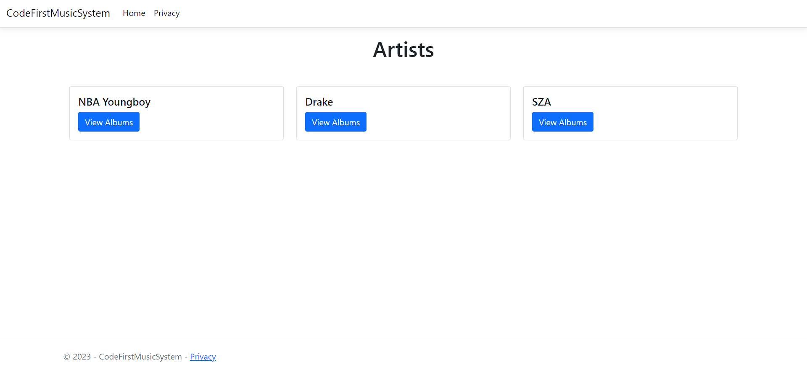
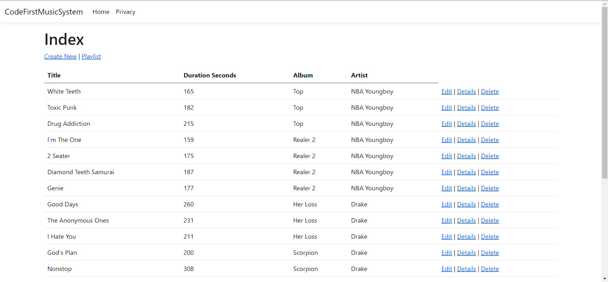
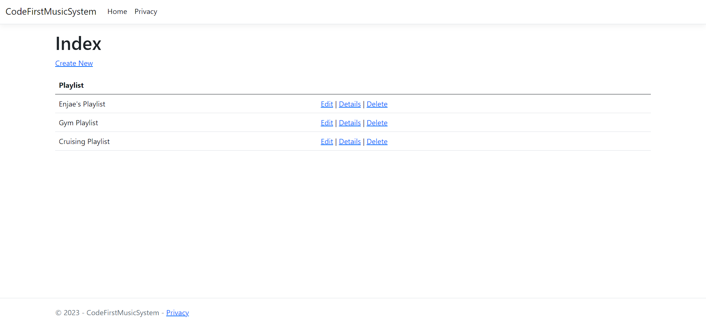
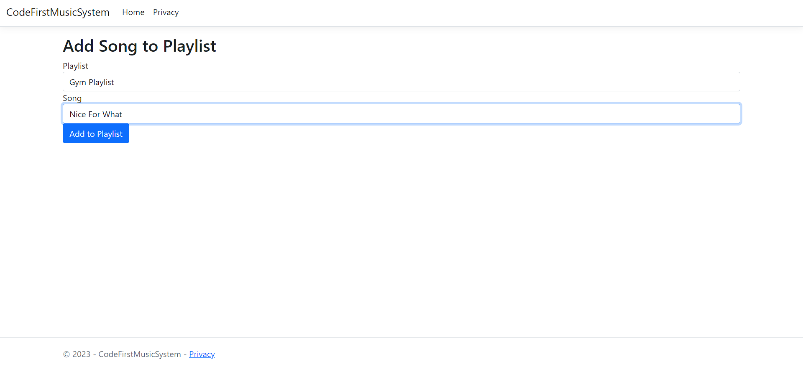

# CodeFirstMusicSystem

This repo is a Full Stack version of a Spotify-like application using the code-first approach. The aim is to create a database that handles songs, albums, artists, and playlists. The project requires creating the User Interface, which includes pages for Playlists, Artists, Albums, Album Details, and Songs. The project must also have a Seed Method to initialize the application with sample data. The project specifies that playlists may be created by any user, and users and libraries are not included in this version.

## Database Design


**Artist:** one-to-many relationship with the SongContributor and Album models.

**GuestArtist:** one-to-many relationship with the Episode model.

**PodcastArtist:** many-to-many relationship with the PodcastCastArtist and Podcast models.

**Song:** one-to-many relationship with the SongContributor and PlaylistSong models, and many-to-one relationship with the Album model.

**Episode:** many-to-one relationship with the Podcast model, and many-to-many relationship with the GuestArtist model.

**MediaCollection:** one-to-many relationship with the Album and Podcast models.

**Playlist:** one-to-many relationship with the PlaylistSong model.
Utilized:

## Seed Method
This code is a Seed method that is responsible for initializing the MusicSystemContext database with some sample data. The method **creates** three Artist objects and adds them to the context if they don't already exist in the database. The method **ensures** that the database is created and migrated before adding the sample data to it. The **purpose** of this method is to provide initial data to the application so that it can be used during development and testing. 
```C#
    public static class SeedData
    {
        public async static Task Initialize(IServiceProvider serviceProvider)
        {
            var context = new MusicSystemContext(serviceProvider.GetRequiredService<DbContextOptions<MusicSystemContext>>());
            context.Database.EnsureCreated();

            context.Database.Migrate();

            Artist artistOne = new Artist("NBA Youngboy");
            Artist artistTwo = new Artist("Drake");
            Artist artistThree = new Artist("SZA");

            if (!context.Artist.Any())
            {
                context.Artist.Add(artistOne);
                context.Artist.Add(artistTwo);
                context.Artist.Add(artistThree);
                await context.SaveChangesAsync();
            }

```

## Images
Here is a sneak peek of images showcasing the code!

### Artists



### Songs



### Playlists



### Add Song to a playlist




